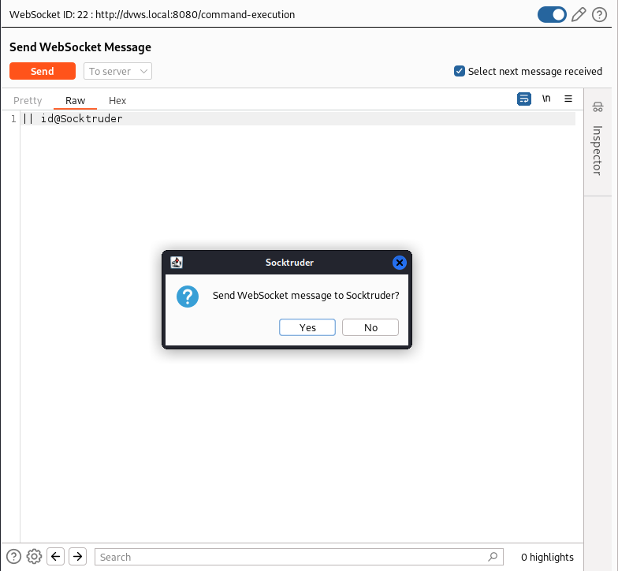
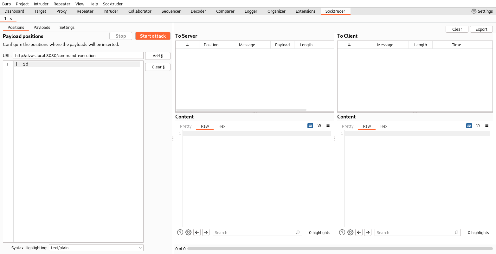
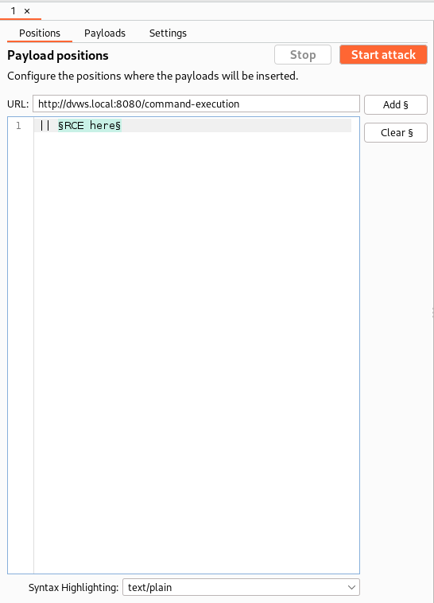
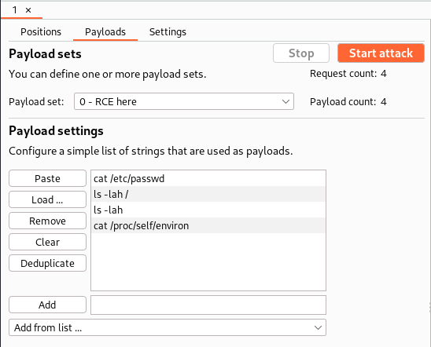
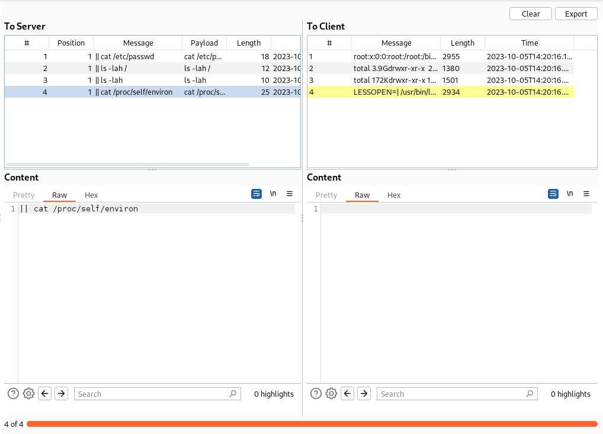
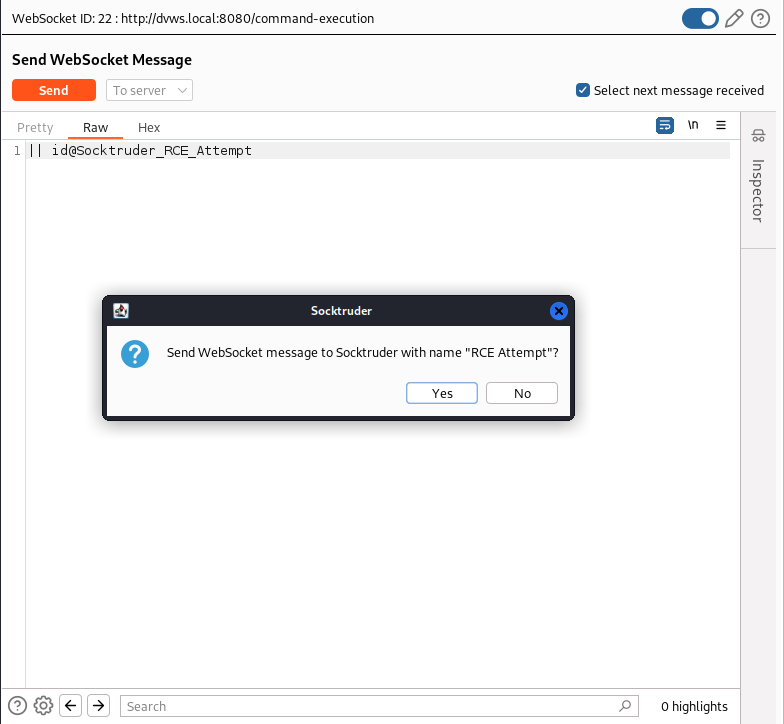
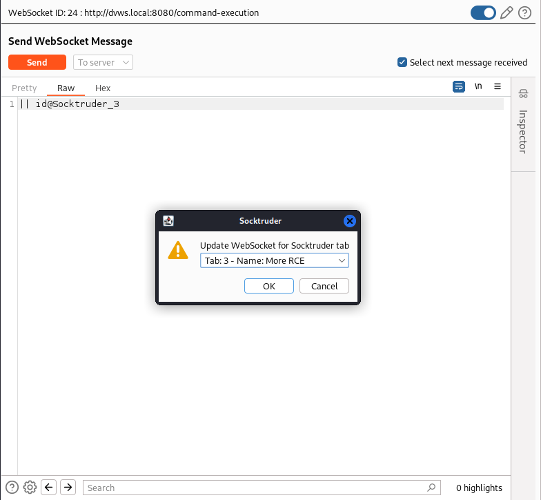
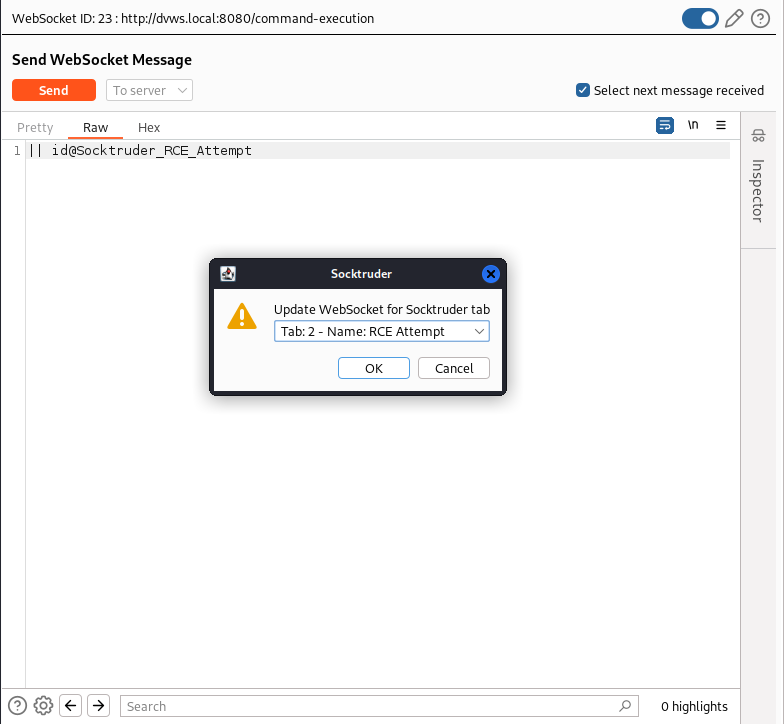
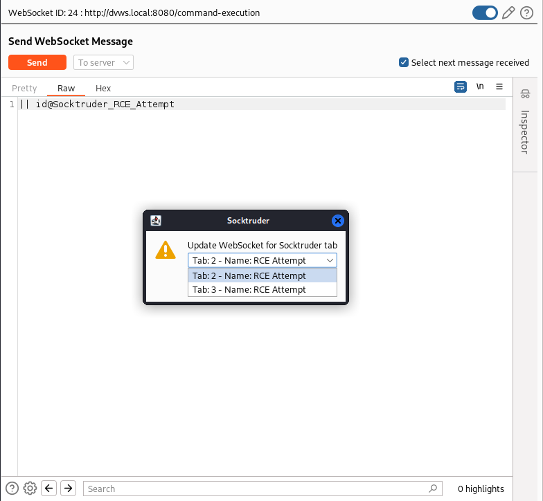
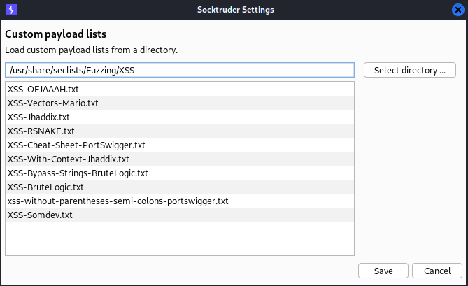

# Socktruder
## What?
Socktruder is the WebSocket Intruder-like Burp extension you have been wishing for. It tries to mimic as close as possible, Burp's Intruder tool while implementing some quality-of-live improvements.

## Why?
Whether it was clunky and unintuitive UI, the inability to hook into existing WebSocket connections, or the all around lack of features, the WebSocket fuzzing tools I have come across miss the mark. That along with the lack of WebSocket support in Burp, I decided to implement what I wanted in a Burp extension.

## Build

To build the necessary JAR file, ensure Maven is installed, clone this repo, and run the following commands:
```bash
cd Socktruder

# Compiles the code into Java class files then packages
# the code and dependencies up into a single JAR file
mvn clean compile assembly:single
```
The JAR file is created at `bin/socktruder.jar`. Load the Socktruder extension by supplying the compiled JAR file to Burp.

## Intruder vs. Socktruder
As a quick note, there are several features that Intruder has that are not implemented in Socktruder. Most features are planned to be implemented in the future. If there is a specific feature you want implemented, create an issue. This will help me know which Intruder features to prioritize.

## Caveats
Due to the lack of WebSocket support in Burp, there are several things that might be weird or annoying. Hopefully as Burp supports more features for WebSockets, these will become better. A caveat of note is that there is no way for Socktruder to know whether the WebSocket is open or closed. There may be times that you start an attack and you receive no messages. If this happens, refer to the [Update WebSocket](#update-websocket) section on how to update the WebSocket.

## Getting Started
### Send to Socktruder
To send a WebSocket message to Socktruder, do the following:

1. Send a WebSocket message to Repeater or use an existing WebSocket connection in Repeater. If the extension was just loaded, it will be necessary to disconnect and reconnect the existing connection in order for Socktruder to see the WebSocket.
2. Insert the text `@Socktruder` anywhere in the message (refer to the [Socktruder Keyword](#socktruder-keyword) section for more details on the Socktruder keyword) and send it.
3. A dialog should show up asking if you want to send the message to Socktruder. Click Yes.



The message is dropped and a new tab is created within the Socktruder tab.



**Note:** Socktruder currently only works with text based WebSocket messages sent to the server. I didn't see a need to fuzz messages send to the client. If this is a desired feature, let me know.

### Configuring the Attack
Configure a Socktruder attack is very similar to how you would do it in Intruder. Insert the marker character to define payload positions.



Configure payloads for each payload set by manually entering them in, loading them from a file, or selecting a custom list (refer to the [Custom Lists](#custom-lists) sections for more details).



**Note**: Different attack types are not currently implemented, but will be implemented in the future. Socktruder iterates through each payload set one at a time.

### Starting the Attack
To start the attack, just click the "Start attack" button. Once started, messages sent will appear in the "To Server" table and messages received will appear in the "To Client" table. Due to the nature of WebSockets, it is impossible to correlate a message sent with a message received. Because of this, while executing the attack, it is very possible that messages in the "To Client" table are not related to the messages being sent.

To help determine which message received is related to which message sent, selecting a row in the "To Server" table will highlight the row in the "To Client" table that is the closest chronologically to the message sent.



Unlike Intruder, executing multiple attacks will not clear the results tables. The results for each execution will be appended to each table. Optionally, the results can be exported to a CSV file.

## Socktruder Keyword
The `@Socktruder` keyword is currently how you send a WebSocket message to Socktruder. This is due to the fact there is a lack of WebSocket support for extensions in Burp. In the future, this will be done through a right click context menu.

### Create New Tab
To create a new Socktruder tab, send a WebSocket message from Repeater containing the `@Socktruder` keyword. Messages containing the keyword are not actually sent to the server.


To create a new Socktruder tab with a specific name, insert `@Socktruder_NAME_HERE` into the message, where `NAME_HERE` is the desired name. Underscores will be replaced with spaces.



### Update WebSocket
If the WebSocket for a Socktruder tab has disconnected for whatever reason, you can update the tab's WebSocket by sending a message containing either `@Socktruder_TAB_NAME` or `@Socktruder_TAB#`, where `TAB_NAME` is the name of the tab and `TAB#` is the tab's number. For example, `@Socktruder_3` would update the WebSocket for the 3rd Socktruder tab.



And `@Socktruder_RCE_Attempt` would update the WebSocket for the tab named "RCE Attempt".



If there are multiple tabs found with the specified name, you will be able to choose which one.



## Global Settings
To configure Socktruder's global settings, click on the Socktruder menu and select the Settings option.
### Custom Lists
Like Intruder, it is possible to add custom payload lists from files. These lists will be available when configuring the payloads for a payload set. Click the "Select directory ..." button to select a directory containing the files you want to use as custom payload lists.



## Disclaimer

This tool should be considered research and should not be used maliciously. The author does not take responsibility for it's use.